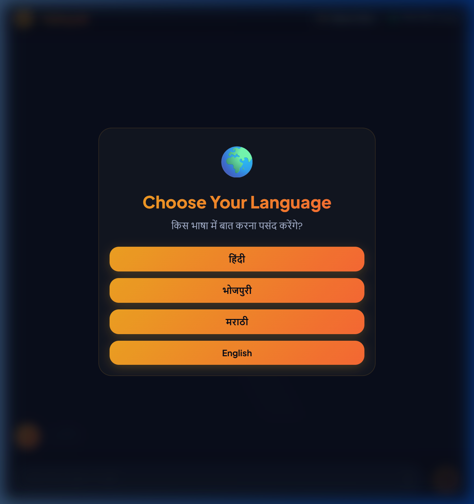

<div align="center">
  <h1>🌟 Sahayak — Your Next-Gen AI Financial Advisor 🌟</h1>
  <p><b>Democratizing Fixed Deposit Returns for Bharat through AI, Localized Linguistics, and Intelligent Graphing.</b></p>

  <h3>🚀 <a href="https://sahayak-fd-advisor.onrender.com/">CLICK HERE FOR LIVE PROJECT DEMO</a> 🚀</h3>
  <p><i>(Evaluators: Please click the link above to test the fully functional live project!)</i></p>

  [](https://python.org)
  [](https://flask.palletsprojects.com/)
  [](https://ai.google.dev/)
  [](https://www.chartjs.org/)
</div>

<br/>

## 🔗 Important Links
- **GitHub Repository:** [Sahayak FD Advisor](https://github.com/ADITYA-PANDEY99/sahayak-fd-advisor)
- **Live Demo URL:** [https://sahayak-fd-advisor.onrender.com/](https://sahayak-fd-advisor.onrender.com/)

---

## 🎯 What is Sahayak?
**Sahayak (meaning "Helper")** is an extraordinary, Generative AI-powered virtual banking agent named **"Ramesh Bhaiya"**. It solves a major problem in the Indian financial ecosystem: *A lack of financial literacy and technical proficiency among rural and non-English speaking demographics.*

Instead of confronting users with intimidating banking interfaces, Sahayak wraps complex mathematical Fixed Deposit (FD) calculations, compounding strategies, and DICGC trust verification into a warm, empathetic, and **hyper-localized conversational interface**.

---

## 🚀 Extraordinary Features Deep-Dive

### 🗣️ 1. Hyper-Localized Multilingual AI Engine
Speak to Sahayak in the language of your roots. Sahayak does not just "translate" text; it adopts the persona, tone, and cultural nuances of regional dialects.
* **Supported Languages:** English, Hindi (हिंदी), Bhojpuri (भोजपुरी), and Marathi (मराठी).
* **Dynamic Adaptation:** The entire interface, from the Agent's avatar ("RB" to "रब") to the typing indicators and mathematical numeric formats, smoothly transforms based on the selected language instantly.

<div align="center">
  
  <br/><em>Seamlessly switch between global and regional Indian languages.</em>
</div>

### 🎨 2. State-of-the-Art Dynamic Theming
An eye-catching, glassmorphism-inspired UI engine that looks breathtaking on both desktop and mobile devices.
* **Deep Ocean Dark Mode:** Features stunning deep blue translucent components, smooth backdrop filters (`backdrop-filter: blur`), and vibrant glowing accent buttons.
* **Interactive Modals:** Beautifully animated popups for language onboarding, goal planning, and real-time alerts.

<div align="center">
  
  <br/><em>Breathtaking Deep Ocean UI with Glassmorphism Sidebars.</em>
</div>

### 📊 3. Interactive Data Visualization (Base64 Graphs)
Say goodbye to boring spreadsheets. Sahayak mathematically plots your financial journey.
* **Canvas-Rendered Bar Charts:** We leverage `Chart.js` to render highly interactive comparative graphs plotting Principal Investment vs. Accumulated Interest.
* **Native Brand SVG Logos:** We re-engineered chart plugins to inject authentic, pixel-perfect **Base64 SVG Bank Brandmarks** (SBI, HDFC, ICICI, Unity SFB, etc.) directly into the graph axes, ensuring visual trust with zero CORS cross-origin load failures.

<div align="center">
  
  <br/><em>Interactive Charts with natively injected Base64 Geometric Bank Brandmarks.</em>
</div>

### 💰 4. Advanced FD Calculator & Laddering Strategy
* **Goal-Oriented Planning:** Tell Sahayak your goal (e.g., "I need ₹2 Lakhs for my child's education in 5 years").
* **Strategic Splitting:** Our AI engine calculates a highly optimized portfolio, splitting funds across 1-year, 2-year, and 5-year FDs at different banks to maximize liquidity and combat inflation.

<div align="center">
  
  <br/><em>Automated Generation of Portfolio Ladders across trusted and high-yield banks.</em>
</div>

### 🛡️ 5. Real-Time DICGC Trust Engine
When suggesting newer, high-yielding Small Finance Banks (e.g., Suryoday SFB offering 8.6%+), the AI engine automatically queries our local DICGC ruleset engine.
* **Safety First:** It highlights the ₹5,00,000 sovereign guarantee backed by the RBI, comforting nervous investors who are historically hesitant to invest outside of major tier-1 nationalized banks.

---

## 🛠️ Technological Architecture

* **Frontend:** Vanilla HTML5, CSS3 Variables (Dynamic Theme Engine), JavaScript (ES6+), Chart.js
* **Backend:** Python 3.11, Flask, Flask-CORS Middleware
* **Core Logic:** Prompt Engineering, Mathematical Laddering, Local JSON Bank Registries
* **Generative AI:** Google Gemini 1.5 Pro API (Text generation, Emotion Detection, Localization)

---

## 💻 How to Run Locally

Get the application running on your own machine in 3 simple steps:

**1. Clone the Repository:**
```bash
git clone https://github.com/ADITYA-PANDEY99/sahayak-fd-advisor.git
cd sahayak-fd-advisor
```

**2. Install Dependencies:**
```bash
python -m venv venv
venv\Scripts\activate  # (On Windows)
pip install -r requirements.txt
```

**3. Configure Environment Variables:**
Create a `.env` file in the root directory and securely add your Google Gemini API key:
```env
# .env file
GEMINI_API_KEY="your_google_gemini_api_key_here"
```

**4. Fire up the Server:**
```bash
flask run
```
Now, simply navigate to `http://localhost:5000` in your browser.

---

<div align="center">
  <b>Built with ❤️ for Bharat. Empowering India's digital financial future.</b><br/>
  <a href="https://github.com/ADITYA-PANDEY99/sahayak-fd-advisor/stargazers">⭐ Drop a Star if you love this project!</a>
</div>
