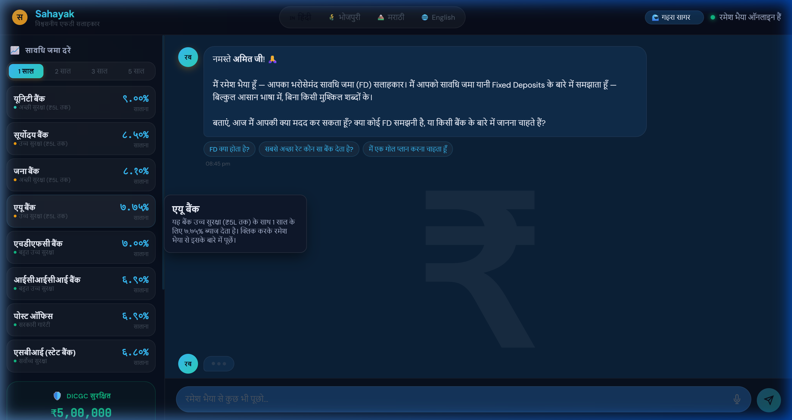
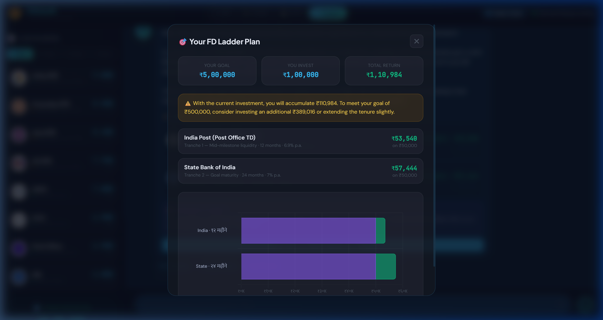
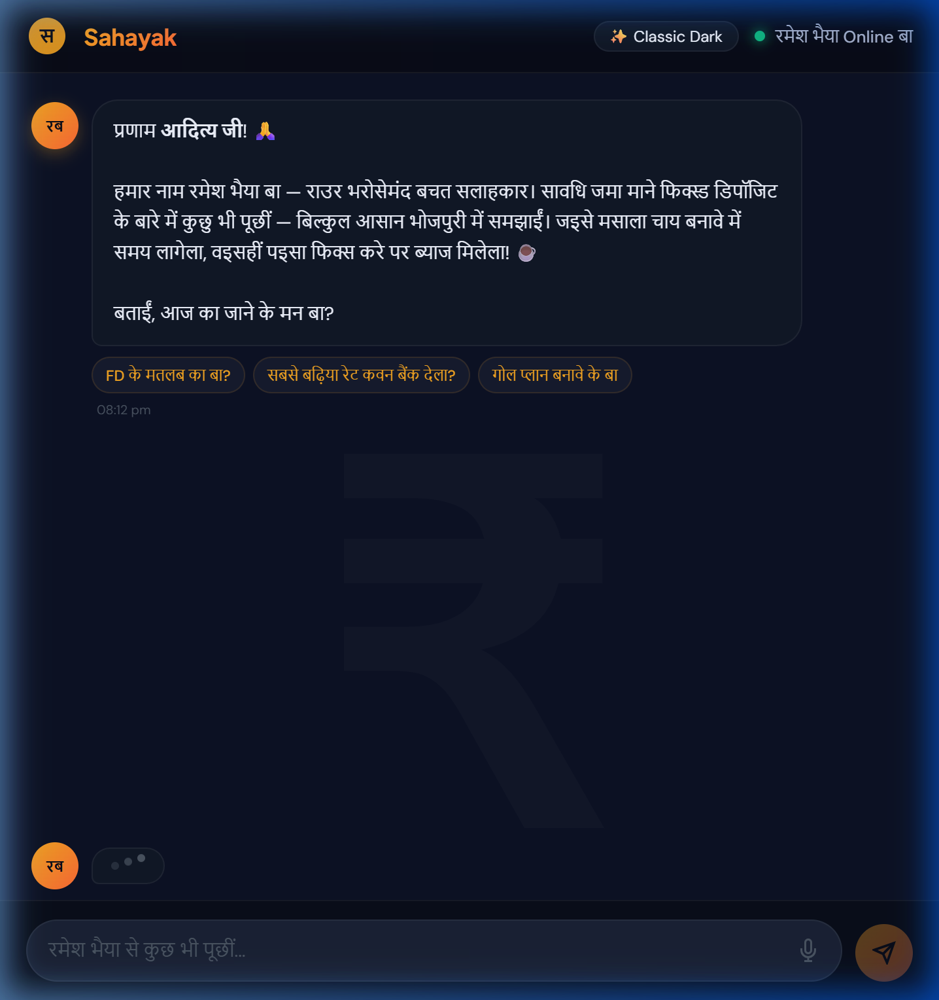

<h1 align="center">Sahayak — Your Trusted FD Advisor 🤖🌟</h1>

  <b>Smart, localized, and jargon-free Fixed Deposit goal planner for Bharat.</b>

## 🔗 Important Links
- **GitHub Repository:** [Sahayak FD Advisor](https://github.com/ADITYA-PANDEY99/sahayak-fd-advisor)
- **Live Demo URL:** [https://6002a4360bf16e.lhr.life](https://6002a4360bf16e.lhr.life) *(Live Tunnel)*

---

## 📸 Snapshots

### 1. Modern Glassmorphism Dashboard

### 2. Live FD Planner & Visual Canvas Chart

### 3. Hyper-Localized Regional Language Persona (Bhojpuri/Marathi/Hindi)

---

## 📖 The Problem
Navigating the complexities of Indian banking and Fixed Deposits (FDs) is challenging for rural and non-English speaking demographics. Calculating returns, understanding compounding, trusting smaller banks, and planning long-term financial goals require financial literacy that many lack.

## 💡 Our Solution
**Sahayak** is a multilingual Gen-AI-powered virtual banking advisor ("Ramesh Bhaiya"). It breaks down banking complexities by conversing in regional languages like Hindi, Bhojpuri, Marathi, and English. 

Instead of showing boring spreadsheets, Sahayak calculates visually engaging FD ladders (Goal Plans), compares high-yield Small Finance Banks (Unity, Suryoday) with trusted giants (SBI, Post Office), and provides easy-to-understand visual charts with official bank brandmarks safely drawn onto an interactive Canvas using Base64 SVGs to bypass rigid CORS limits.

---

## 🚀 "Wow Factor" Features

1. **Regional Language AI with Persona (Bhojpuri, Marathi, Hindi, English)**: Talk to the bot normally using speech or text; it mimics local dialects dynamically via Google Gemini.
2. **Automated FD Goal Planner (Laddering Strategy)**: Tell it your monetary goal (e.g. ₹1,00,000 for a wedding), and Sahayak mathematically optimizes a portfolio split across 1-year, 2-year, and 5-year FDs.
3. **Interactive & Visual Canvas Charts**: Renders highly responsive bar charts of investments vs. interest earned using `Chart.js`, complete with inline Bank Brandmarks (SVG logos naturally embedded without external HTTP calls).
4. **100% Real-time DICGC Trust & Safety Engine**: Actively warns users about risks and highlights DICGC's ₹5 Lakh sovereign guarantee whenever suggesting aggressive high-yielding Small Finance Banks.
5. **Dynamic Deep Ocean Glassmorphism UI**: High-end CSS visuals featuring translucent blur effects (`backdrop-filter`), micro-animations, and animated typing indicators.

---

## 🛠️ Tech Stack
* **Frontend:** Vanilla HTML5, CSS3 (Glassmorphism), JavaScript (ES6+), Chart.js
* **Backend:** Python 3.11, Flask, Flask-CORS
* **Generative AI:** Google Gemini 1.5 API 
* **Hosting:** Render/Gunicorn Ready

---

## ⚙️ How to Run Locally
1. Clone the repo: `git clone https://github.com/ADITYA-PANDEY99/sahayak-fd-advisor.git`
2. Create virtual environment: `python -m venv venv` and activate it.
3. Install dependencies: `pip install -r requirements.txt`
4. Set `.env` file with: `GEMINI_API_KEY=your_key_here`
5. Run the app: `flask run` (or `python app.py`)
